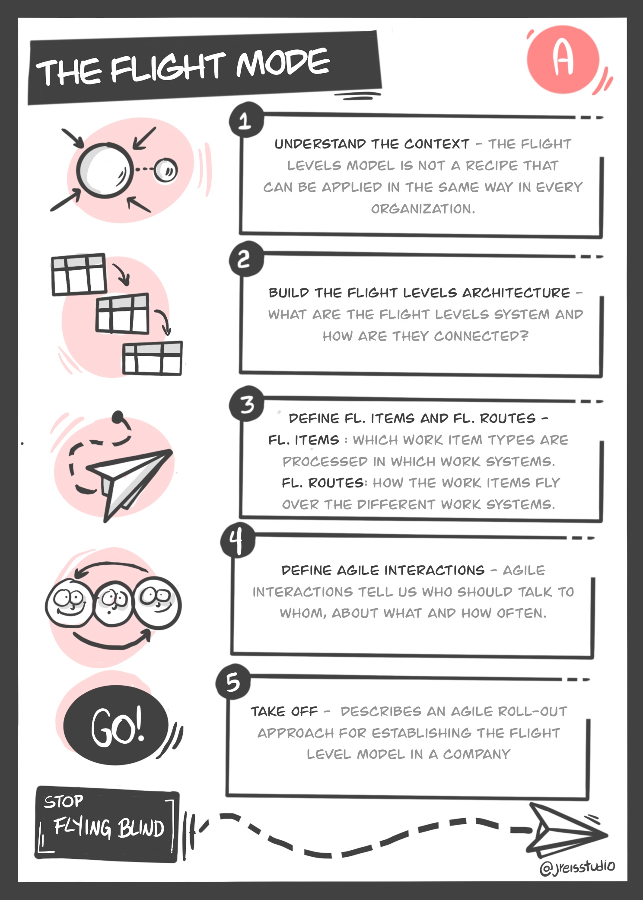

## CARDS

### THEORETICAL CARDS
Cards that represent  the theory behind the Flight Levels. They must be read and discussed before anything else, so everybody has the same understanding about what Flight Levels mean.

### ARCH. SAMPLE CARDS
Learning by Example! With those cards we can see some Architecture samples and have ideas to sketch our own model. There isn't a right model, but we can learn a lot by visualizing a lot of "wrong ones" 

### TIPS AND TRAPS
Tips and traps is a collection of learnings we are acquiring during our  Flight Levels Journey.
